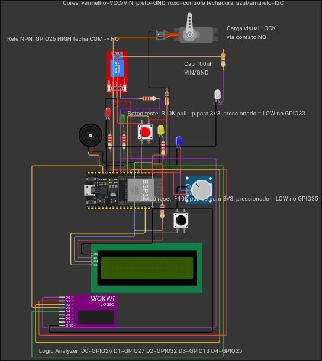

# VaultSign - Cofre Inteligente com ESP32

## 👤 Identificação do Candidato

- **Nome completo:** Thiago Nerton Macedo Alves
- **GitHub:** https://github.com/Nertonm/processoseletivoIoT

## 1️⃣ Visão Geral da Solução

VaultSign é um cofre inteligente simulado em ESP32/MicroPython. O firmware
recebe dígitos pela Serial, valida um PIN de 4 dígitos e controla os
periféricos do cofre: relé, servo, LEDs, buzzer e LCD.

O projeto representa a camada embarcada da solução. O reconhecimento dos
dígitos é responsabilidade de um módulo de IA desenvolvido em repositório
separado. A IA identifica cada dígito e envia o caractere pela Serial. O
firmware recebe essa entrada e decide se o acesso deve ser liberado, bloqueado
ou colocado em lockout.

### Situação-Problema

Cofres residenciais convencionais não registram tentativas de acesso, não
alertam sobre falhas consecutivas e não oferecem auditoria. Uma vez violados,
não há como determinar quando ocorreu o acesso, quantas tentativas foram feitas
ou se houve tentativa de força bruta.

A proposta do VaultSign é resolver esse cenário com controle de acesso por PIN,
feedback imediato a cada tentativa, bloqueio automático após falhas
consecutivas e registro dos eventos no monitor serial. A arquitetura também
deixa espaço para envio dessas ocorrências a um endpoint externo, permitindo
auditoria remota e rastreabilidade.

### Como Testar no Wokwi

1. Abra o projeto no Wokwi usando `diagram.json` e `wokwi.toml`.
2. Inicie a simulação.
3. Digite os caracteres do PIN no monitor serial.
4. Use `1234` para simular acesso autorizado.
5. Digite três PINs incorretos para acionar o estado `LOCKOUT`.

Durante a execução, o firmware imprime `VaultSign iniciado.` no boot, mostra
mensagens no LCD, mascara o PIN nos logs e atualiza os sinais visuais conforme
o estado do cofre.

## 2️⃣ Arquitetura do Sistema Embarcado

### Fluxo Principal

O loop principal do firmware executa continuamente cinco etapas:

1. Lê um caractere da Serial com `entrada.ler_char()`.
2. Processa a entrada com `maquina.processar_entrada(char, agora)`.
3. Verifica botões com `maquina.verificar_botao(agora)`.
4. Atualiza o estado com `maquina.atualizar(agora)`.
5. Aguarda `50 ms` antes da próxima iteração.

Esse desenho mantém o firmware responsivo enquanto aguarda entrada do usuário,
pisca LEDs, atualiza o lockout e verifica os botões físicos.

### Estrutura do Repositório

| Caminho | Descrição |
|---|---|
| `src/main.py` | Ponto de entrada, instanciação dos módulos e loop principal |
| `src/config.py` | Pinos, estados, PIN, timeouts, mensagens e comandos |
| `src/logger.py` | Logs por nível e mascaramento de PIN |
| `src/input_handler.py` | Leitura não bloqueante da Serial e buffer do PIN |
| `src/display.py` | Interface semântica do LCD 1602 |
| `src/hardware.py` | Controle dos periféricos e fachada `HardwareVaultSign` |
| `src/state_machine.py` | Máquina de estados do cofre |
| `src/lcd1602.py` | Driver I2C do LCD |
| `diagram.json` | Circuito da simulação no Wokwi |
| `wokwi.toml` | Configuração da simulação |
| `Dockerfile` | Geração do filesystem MicroPython (`fs.bin`) |
| `.github/workflows/ci.yml` | Pipeline de build e simulação |

### Arquitetura do Firmware

O firmware foi dividido em módulos pequenos, cada um com uma responsabilidade
clara. `main.py` apenas inicializa os componentes e executa o loop. A lógica de
negócio fica em `state_machine.py`, enquanto o acesso aos periféricos é
concentrado em `hardware.py`.

Todos os módulos importam constantes de `config.py`. Isso facilita comparar o
código com o circuito, porque pinos, estados, timeouts e mensagens ficam em um
único ponto.

A máquina de estados não manipula `Pin`, `PWM`, `ADC` ou I2C diretamente. Ela
chama métodos de alto nível, como `sinalizar_acesso_ok()`, `mostrar_lockout()`
e `fechar_servo()`. Essa separação deixa o comportamento do cofre mais fácil de
ler, testar e adaptar.

### Máquina de Estados

| Estado | Condição | Comportamento |
|---|---|---|
| `AGUARDANDO` | Buffer vazio ou retorno de outro estado | Servo fechado, relé desligado, LCD `Aguardando PIN`, LED amarelo piscando |
| `DIGITANDO` | Primeiro dígito válido recebido | LED amarelo aceso, LCD com asteriscos, buffer em memória |
| `VALIDANDO` | Buffer atinge 4 dígitos | LCD `Validando...`, comparação com `PIN_CADASTRADO` |
| `ACESSO_OK` | PIN correto | Servo abre, LED verde acende, relé liga `LOCK` por 3 s, tentativas zeradas |
| `BLOQUEADO` | PIN incorreto, ainda com tentativas restantes | LED vermelho, buzzer, LCD `PIN INVALIDO` e `Tent N/3`, retorno após 800 ms |
| `LOCKOUT` | Terceira falha consecutiva | LED vermelho, buzzer, LCD com contagem regressiva de 10 s, entradas ignoradas |

### Integração com o Módulo de IA

Neste repositório, o ESP32 não executa o modelo de IA. Ele recebe pela Serial o
dígito que já foi reconhecido pelo módulo externo. Na simulação do Wokwi, essa
entrada chega ao MicroPython por `sys.stdin`.

O `SerialInputHandler` faz o tratamento necessário antes de entregar o dado para
a máquina de estados: remove espaços e quebras de linha, aceita apenas
caracteres de `0` a `9` e monta o PIN até completar `TAMANHO_PIN = 4`. Com o
buffer completo, a `VaultSignStateMachine` entra em `VALIDANDO` e compara o
valor recebido com o PIN cadastrado.

Se futuramente a inferência rodar no próprio ESP32, a troca fica concentrada na
origem da entrada. Em vez de ler da Serial, o firmware chamaria um módulo local
de inferência. Para a máquina de estados, a interface continuaria igual: receber
um dígito por vez e decidir o acesso.

## 3️⃣ Componentes Utilizados na Simulação

### Hardware Utilizado

| Função | Componente | GPIO | Papel |
|---|---|---|---|
| Controlador | `esp1` (ESP32 DevKit C v4) | Não se aplica | Executa o firmware MicroPython |
| Entrada serial | `$serialMonitor` | TX/RX | Recebe dígitos e comandos de debug |
| Buzzer | `bz1` | GPIO13 | Alerta sonoro em erro e lockout |
| LED verde | `led_verde1` | GPIO25 | Indica `ACESSO_OK` |
| LED vermelho | `led_verm1` | GPIO27 | Indica `BLOQUEADO` e `LOCKOUT` |
| LED amarelo | `led_amar1` | GPIO32 | Indica `AGUARDANDO` e `DIGITANDO` |
| Relé | `relay1` | GPIO26 | Aciona a carga `LOCK` |
| Carga LOCK | `led_load` | Contato NO do relé | Representa a fechadura energizada |
| Botão auto-teste | `btn_test1` | GPIO33, pull-up 10k | Testa LEDs, relé, servo e buzzer |
| Botão reset | `btn_rst1` | GPIO35, pull-up 10k | Reinicia o firmware via `machine.reset()` |
| Potenciômetro | `pot1` | GPIO34 ADC | Controla o volume do buzzer |
| LCD 1602 I2C | `lcd1` | GPIO21/GPIO22 | Exibe estado, tentativas e lockout |
| Servo | `servo1` | GPIO14 PWM | Representa a abertura da trava |
| LED alimentação | `led_pwr1` | 3V3/GND | Referência visual de alimentação |
| Proteção | `cap_rele`, `flyback` | VIN/GND, carga do relé | Desacoplamento e proteção contra transientes |
| Logic analyzer | `logic` | D0 a D4 | Observa sinais principais na simulação |
| Motor visual | `motor` | Sem acionamento | Identifica visualmente a fechadura |

## 4️⃣ Decisões Técnicas Relevantes

### Firmware modular

O firmware foi dividido em `main.py`, `config.py`, `hardware.py`, `display.py`,
`input_handler.py`, `state_machine.py`, `logger.py` e `lcd1602.py`. Essa
organização permite ler a máquina de estados sem passar pela inicialização de
pinos ou pelo driver do LCD.

### Configuração centralizada

`config.py` concentra pinos, estados, PIN, timeouts e mensagens. Para comparar
firmware e circuito, basta abrir esse arquivo. Não há chamadas diretas a
`Pin(número)` espalhadas pelo código.

### Imports seletivos para MicroPython

Os módulos usam `from config import X, Y` em vez de importar o módulo inteiro.
Em MicroPython no ESP32, memória é um recurso limitado. Cada dependência também
fica explícita no topo do arquivo.

### PIN hardcoded por decisão explícita

`PIN_CADASTRADO = "1234"` fica em `config.py` com comentário indicando que o
valor hardcoded é intencional para simulação. Em produção, esse ponto deveria
ser substituído por algo mais seguro.

### Entrada serial não bloqueante

`input_handler.py` usa `sys.stdin` com `select.poll()`. Assim o firmware
continua piscando LEDs, atualizando lockout e verificando botões enquanto
aguarda dígitos.

### Máquina de estados explícita

Os seis estados do cofre são declarados em `config.py` e tratados em
`state_machine.py`: `AGUARDANDO`, `DIGITANDO`, `VALIDANDO`, `ACESSO_OK`,
`BLOQUEADO` e `LOCKOUT`. O estado `VALIDANDO` foi mantido separado para marcar
o momento em que o buffer deixa de ser entrada e passa a ser decisão de acesso.

### Coleta de lixo fora do loop recorrente

`gc.collect()` é chamado apenas ao entrar em `ACESSO_OK` e `LOCKOUT`, estados
menos frequentes e com pausa natural no fluxo. Em MicroPython, a coleta é
bloqueante. Por isso ela foi evitada no caminho recorrente.

### Carga LOCK ligada pelo contato do relé

O LED branco `LOCK` representa a carga visual no contato `NO` do relé, não uma
carga ligada diretamente ao GPIO26. Isso separa o comando do microcontrolador
do acionamento do contato.

### Reset por software no GPIO35

O botão de reset usa GPIO35 e chama `machine.reset()`. O pino `EN` não funcionou
como esperado no Wokwi, então o reset por software foi adotado para reiniciar o
firmware.

## 5️⃣ Resultados Obtidos

O fluxo completo do cofre está implementado:

- em repouso, o sistema fica em `AGUARDANDO`, com servo fechado e LED amarelo
  piscando.
- ao digitar, entra em `DIGITANDO`, mostra asteriscos no LCD e mascara o PIN
  no log.
- ao completar 4 dígitos, entra em `VALIDANDO`.
- com PIN correto, abre o servo, acende o LED verde e energiza `LOCK` por 3 s.
- com PIN incorreto, aciona LED vermelho, buzzer e registra a tentativa no LCD.
- após três falhas consecutivas, entra em `LOCKOUT` por 10 s e ignora novas
  entradas.

O volume do buzzer segue o potenciômetro em GPIO34. O botão de auto-teste
percorre os periféricos principais. O botão de reset reinicia o firmware.

## 6️⃣ Comentários Adicionais 

### Limitações

Limitações assumidas nesta entrega:

- **PIN hardcoded:** aceitável em simulação, inadequado em produção.
- **Auto-teste bloqueante:** adequado para demonstração no Wokwi. Em produção
  deveria ser convertido para controle por `ticks_ms()`.
- **Reset por software:** depende do loop principal estar ativo.
- **Sem persistência segura, criptografia ou telemetria externa.**

Para uma versão de produção, os próximos passos seriam adicionar armazenamento
seguro do PIN, watchdog, tratamento de falha de energia, auto-teste não
bloqueante, telemetria autenticada e testes da máquina de estados.
